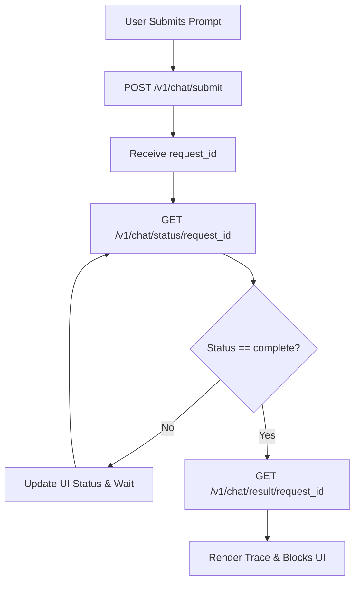

# X-chat App Architecture and API Implementation Guide

## 1. App Architecture Design

The frontend application (`app.py`) is built using **Streamlit** and is designed to operate in a dual-mode interface, combining traditional Business Intelligence (BI) capabilities with an interactive AI Chatbot.

### 1.1 Core Components
* **Dual-Mode System**:
  * **Normal Mode (Dashboard)**: Traditional menu-driven views including "Dashboard", "Introduction", and "Schedule". Displays predefined KPI metrics, charts, and transaction logs.
  * **AI Assistant Mode**: A conversational interface powered by an LLM that allows users to ask natural language questions and receive multi-modal block responses (text, Plotly charts, maps, metrics).
* **State Management**: Heavily utilizes `st.session_state` to track:
  * `authentication_status`, `name`, `username`: For user auth sessions.
  * `chat_history`, `current_chat`: To persist AI chat messages across reruns.
  * `normal_view`: To track the active page in Normal mode.
  * `close_sidebar_flag`: For programmatic UI control.
* **Authentication**: Handled via `streamlit-authenticator`. Configuration checks Streamlit Secrets (`st.secrets`) first for production, falls back to local `auth_config.yaml`, and auto-initializes defaults if missing.
* **Custom UI Adjustments**: 
  * Injects custom CSS to hide Streamlit's default headers and footers.
  * Uses sandboxed HTML/Javascript injection (`st.components.v1.html`) to programmatically close the sidebar for a smoother user experience when switching views.

---

## 2. Required Backend APIs

The current implementation contains multiple placeholder functions marked with `TODO [BACKEND API]`. These need to be connected to real backend services.

### 2.1 Normal Mode (Dashboard) APIs
The dashboard requires endpoints to fetch real-time metrics and historical data, as well as AI-generated text insights for context.
* **KPI Metrics**
  * **Input**: User/Organization ID, Timeframe.
  * **Output**: Values and deltas for Total Users, Active Sessions, and Revenue.
  * *Additional*: A summarized AI insight string explaining the metrics.
* **Data Fetch API** (Data Processing & Caching Layer)
  * **Purpose**: Fetches, filters, aggregates, and caches raw data. This allows the LLM to pull specific cuts of data efficiently. The caching mechanism lives here: if the underlying database has not changed and the exact same query parameters are requested, it serves the cached data frame.
  * **Endpoint**: `POST /v1/data/fetch`
  * **Input**:
    * `raw_data_source`: Reference to the underlying raw data (e.g., `sales_table`, `user_geo_table`).
    * `columns`: List of columns needed.
    * `filters`: Array of filter conditions (e.g., `[{"column": "region", "operator": "==", "value": "North"}]`).
    * `groupby`: Array of columns to group by (e.g., `["Date", "Product"]`).
    * `aggregation`: Aggregation metrics (e.g., `{"revenue": "sum", "users": "count"}`).
    * `limit` / `offset`: For pagination.
  * **Output**: A JSON array of records (the processed/sliced data).

* **Universal Chart Generation API** (Stateless Rendering Layer)
  * **Purpose**: A single, unified API for rendering any graph. It does **not** fetch data from the database or cache data. It simply takes a dataset directly from the LLM (or frontend) and a configuration, and returns the visualization instructions.
  * **Endpoint**: `POST /v1/charts/generate`
  * **Input**: 
    * `chart_type`: The type of graph to draw (e.g., `line`, `bar`, `scatter`, `map`).
    * `data`: The actual data payload to plot (usually the output obtained from the **Data Fetch API**).
    * `config`: Chart configuration (e.g., `{"x": "Date", "y": "revenue", "color": "Product"}`).
  * **Output**: A **Plotly JSON spec** that Streamlit can render directly using `st.plotly_chart()` (identical to the `plotly` block in the AI response).
  * *Additional*: An optional AI insight string interpreting the generated graph.

  **Data Fetch & Chart Generation Flowchart:**
  ```mermaid
  flowchart TD
      A[LLM Agent requests data: POST /v1/data/fetch] --> B{Cache Hit?}
      B -- Yes --> C{Has Raw Data Updated?}
      B -- No --> D[Fetch Raw Data from DB]
      C -- Yes --> D
      C -- No --> E[Return Cached Processed Data]
      D --> F[Apply Filters, GroupBy, Aggregations]
      F --> G[Update Cache]
      G --> E
      
      E --> H[LLM decides chart type and configuration]
      H --> I[LLM requests chart: POST /v1/charts/generate]
      I --> J[Generate AI Insight]
      J --> K[Return Plotly JSON Spec]
  ```

* **Transactions Log** (Data Table)
  * **Input**: Pagination parameters (limit, offset/page), filters (status).
  * **Output**: List of recent transaction objects (Date, Amount, Status).
  * *Additional*: AI insight highlighting anomalies or failure rates.

### 2.2 AI Chat Mode APIs
The chat interface utilizes a real asynchronous request/polling cycle, compliant with `api_response_spec.md`.

**AI Chat Mode Polling Flowchart:**


* **1. Submit Chat Request**
  * **Endpoint**: `POST /v1/chat/submit`
  * **Input**: User Prompt, `chat_id`, User context/history.
  * **Output**: `request_id` (Task tracking ID).
* **2. Poll for Status**
  * **Endpoint**: `GET /v1/chat/status/{request_id}`
  * **Input**: `request_id`.
  * **Output**: Current status/step (e.g., "Analysing request...", "Calling tools..."). Used to update the Streamlit `st.status` expander in real-time.
* **3. Fetch Final Result**
  * **Endpoint**: `GET /v1/chat/result/{request_id}`
  * **Input**: `request_id`.
  * **Output**: Standardized JSON conforming to `api_response_spec.md`.
    * `blocks`: Array of content blocks (`text`, `plotly`, `map`, `metric`).
    * `trace`: Array of internal execution steps (`llm_call`, `tool_call`, `sub_agent`, `query`) for the reasoning expander.

### 2.3 General Platform APIs

* **Telemetry & Audit API**
  * **Purpose**: To track LLM usage (Token cost, latency), count chart generations, and log user questions for the final summary reporting. It is **highly recommended** to implement this as a centralized backend logging API that is automatically invoked asynchronously by existing backend processes (like inside `POST /v1/chat/result` or `POST /v1/data/fetch`). Do not rely on the LLM or frontend to manually report logs, as this is error-prone.
  * **Endpoint**: `POST /v1/telemetry/log` 
  * **Input Payload Example**:
    ```json
    {
      "event_type": "string (e.g., 'llm_call', 'chart_generated', 'user_query')",
      "user_id": "string",
      "session_id": "string",
      "timestamp": "ISO-8601 string",
      "metrics": {
          "tokens_used": "integer (optional)",
          "latency_ms": "integer",
          "cache_hit": "boolean"
      },
      "metadata": {
          "query_text": "string (optional)",
          "chart_type": "string (optional)",
          "model_version": "string (optional)"
      }
    }
    ```
  * **Details**:
    * `llm_call`: Count LLM tokens, model overhead, and answer generation time.
    * `chart_generated`: Track which `raw_data_source` and chart configs are most active, and calculate cache hit rates.
    * `user_query`: Save the exact queries users typed. Later, this feeds into a dashboard that shows "Most trending questions".

* **User Feedback Collection**
  * **Endpoint**: `POST /v1/feedback`
  * **Input**: 
    ```json
    {
      "user_id": "string",
      "rating": "integer (1-5)",
      "message": "string (optional)",
      "timestamp": "ISO-8601 string",
      "context": "string (e.g., 'ai_mode' or 'normal_mode')"
    }
    ```
  * **Output**: Success confirmation (200 OK).
